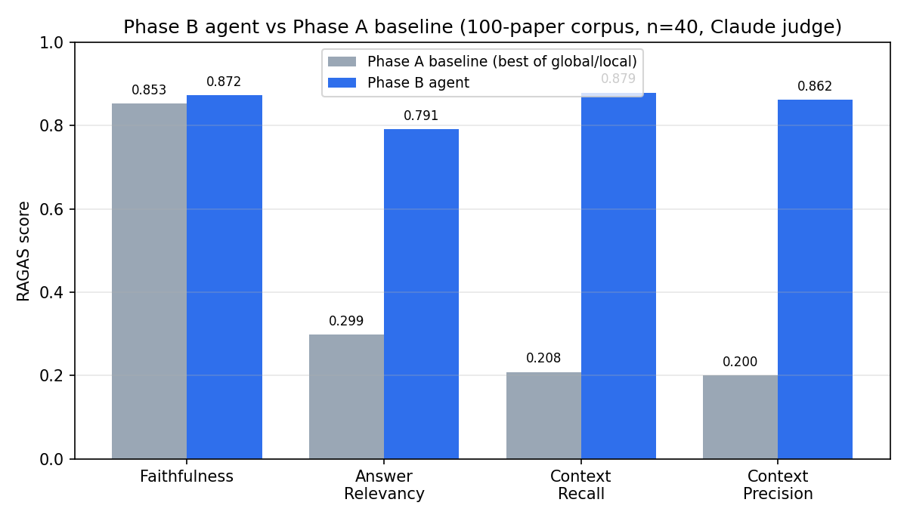
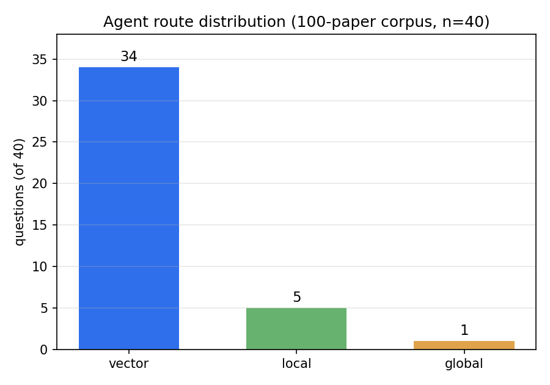
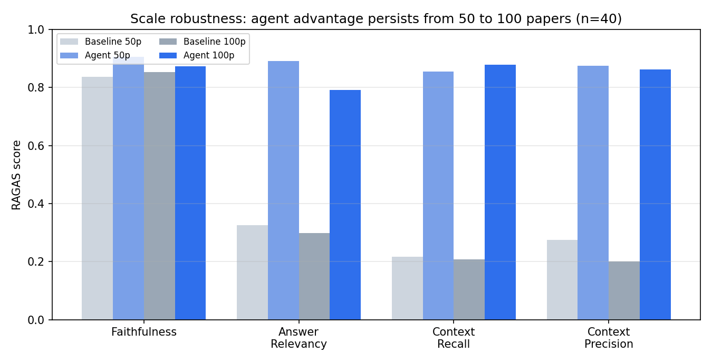
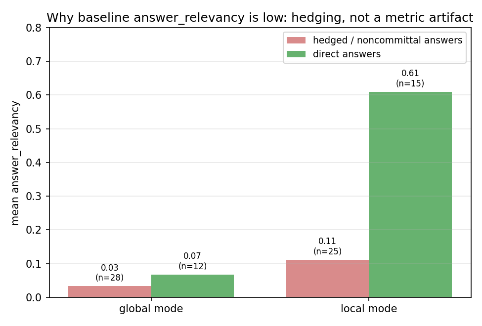

# From GraphRAG to Agentic RAG: Adaptive Routing, Grading, and Self-Reflection over a RAG-Literature Knowledge Graph

*Technical report — graphrag-paper. 100-paper corpus, n=40 evaluation. 2026-05-28.*

---

## 한국어 초록 (Korean Abstract)

검색 증강 생성(RAG)에 관한 연구 논문 100편을 코퍼스로 삼아, **GraphRAG**(엔티티·관계 추출 → 지식 그래프 → Leiden 커뮤니티 → global/local 검색)를 먼저 단방향 baseline으로 고정한 뒤, 그 위에 **Agentic RAG 루프**(적응형 라우팅 · 검색 충분성 채점 · 질의 재작성 · 자기 성찰)를 LangGraph로 얹었다. 동일한 40개 평가 질문과 동일한 RAGAS judge(Claude + 로컬 fastembed 임베딩)로 두 시스템을 직접 비교했다.

100편 코퍼스에서 agent는 baseline(global/local 중 더 나은 쪽)을 **answer_relevancy +0.493(0.299→0.791), context_recall +0.671(0.208→0.879), context_precision +0.662(0.200→0.862)** 로 크게 앞섰고, faithfulness는 +0.019(0.853→0.872)로 비등했다. 동일 결론이 코퍼스를 50→100편으로 키워도 유지됐으며(검색 품질 지표 격차는 오히려 확대), agent는 40개 질문 중 34개를 dense passage 검색으로 라우팅했다.

중요한 것은 baseline의 낮은 점수가 메트릭의 결함이 아니라 **진짜 검색 실패를 정직하게 보고한 결과**라는 점이다 — global 답변의 28/40이 "해당 정보 없음"으로 헷지했고(faithfulness는 0.853로 높게 유지), RAGAS는 이런 noncommittal 답변을 0으로 매긴다. 따라서 본 보고서는 답변 표현에 영향받지 않는 **context recall/precision을 1차 증거로** 제시하고, answer_relevancy는 noncommittal 페널티로 격차가 다소 증폭됨을 명시한다. 한계로는 단일 judge, 단일 도메인, n=40 규모, 합성 질문을 든다.

---

## Abstract

We build a corpus of 100 research papers on retrieval-augmented generation (RAG) and study whether an **agentic retrieval loop** improves over a fixed **GraphRAG** baseline on the same questions and the same judge. Phase A (GraphRAG) extracts a typed entity/relation knowledge graph, detects Leiden communities with LLM summaries, and answers via global (community-summary) and local (entity-subgraph) search. Phase B (Agentic RAG) composes, in LangGraph, an adaptive router (global/local/vector), an LLM grader with conditional wider re-retrieval, query rewriting on the escalation path, and a self-reflection hallucination check with bounded regeneration. Both systems are scored with RAGAS (faithfulness, answer_relevancy, context_recall, context_precision) using a Claude judge with local fastembed embeddings.

On the 100-paper corpus (n=40), the agent beats the *best* of the two baseline modes by **+0.493 answer_relevancy, +0.671 context_recall, and +0.662 context_precision**, with comparable faithfulness (+0.019). The conclusion holds when the corpus is scaled from 50 to 100 papers — the retrieval-quality gap actually widens. We decompose the baseline's low scores and show they reflect a genuine retrieval failure honestly reported (28/40 global answers hedge; baseline faithfulness stays 0.853), with the answer_relevancy gap amplified by RAGAS's noncommittal penalty. We therefore lead with the phrasing-independent context metrics. We also report a methodological lesson: an output-token cap silently truncated entity/relation extraction on long papers, and we document the fix and its effect on the cross-scale comparison.

---

## 1. Introduction

Retrieval-augmented generation grounds a language model's output in retrieved text, improving factuality on knowledge-intensive questions. **GraphRAG** extends this by organizing a corpus into a knowledge graph and reasoning over community summaries, which excels at broad, thematic questions ("what approaches improve RAG?") but is weaker on **fact-specific** questions whose answer is a concrete number, score, or mechanism buried in a single paper. Summaries abstract away exactly those details.

**Agentic RAG** addresses this by making retrieval adaptive and self-correcting: route each query to the retriever most likely to hold the answer, judge whether the retrieved context actually suffices, re-retrieve or rewrite when it does not, and check the final answer for hallucination. This report asks a concrete, measurable question:

> Given a fixed GraphRAG baseline, **how much does an agentic loop improve answer and retrieval quality** on the same questions and judge — and does the improvement survive corpus scaling?

Our contributions:

1. A reproducible two-phase system — GraphRAG baseline (Phase A) and an agentic loop on top of the same retrievers (Phase B) — wired as a typed, end-to-end pipeline.
2. A controlled comparison on a 100-paper RAG-literature corpus (n=40, identical judge), showing large agent gains on retrieval-quality metrics and answer relevancy.
3. A **fairness decomposition** showing the baseline's low scores are honest retrieval failures (not a metric artifact), and a principled recommendation to lead with context recall/precision.
4. A scaling study (50→100 papers) and an honest account of a truncation bug surfaced at scale.

---

## 2. Related Work

- **RAG / dense retrieval.** Lewis et al. (2020) introduced RAG; Dense Passage Retrieval (Karpukhin et al., 2020) and Fusion-in-Decoder (Izacard & Grave, 2020) established retrieve-then-read with dense retrievers. Our vector route is a standard dense-passage retriever (fastembed + Chroma).
- **GraphRAG.** Microsoft's GraphRAG organizes a corpus into an entity/relation graph with hierarchical community summaries for global ("query-focused summarization") and local search. Phase A is a compact reimplementation of this idea over a single domain.
- **Adaptive / corrective retrieval.** Self-RAG, Corrective RAG (CRAG), and adaptive-retrieval work add reflection, retrieval grading, and conditional re-retrieval. Phase B composes these ideas — routing, grading + escalation, rewriting, reflection — as explicit LangGraph nodes with bounded retries, rather than a single end-to-end-trained policy.

The point here is not a new algorithm but a **clean, instrumented comparison** of a graph baseline against an agentic loop built on the same retrievers, with an honest treatment of evaluation.

---

## 3. Method

### 3.1 Corpus construction

Seeds (Lewis et al. 2020 RAG; Fusion-in-Decoder) are expanded by forward citations via the Semantic Scholar Graph API. Candidates are filtered to those with an arXiv ID, year ≥ 2019, and a non-empty abstract, then scored by a weighted sum of keyword match (RAG-lexicon hits), log-citation count, and recency. The top **100** are selected (validated first at 50, then expanded — §6.2).

Sections are extracted **LaTeX-source-first** (arXiv) with a GROBID PDF fallback; the retained text per paper is `abstract + intro + related_work`. With GROBID disabled in this run, a few papers fall back to abstract-only. The cleaned corpus is one JSON document per paper.

### 3.2 Phase A — GraphRAG baseline

**Entity / relation extraction.** Each paper's text is sent to `claude-haiku-4-5` with a schema-constrained prompt. The schema is domain-specific:

- **Entity types (8):** Method, Model, Dataset, Metric, Task, Author, Institution, Paper.
- **Relation types (7):** USES, EVALUATED_ON, IMPROVES, OUTPERFORMS, COMBINES, PROPOSED_BY, CITES.

`Paper` entities are created deterministically (one per corpus doc); `CITES` edges are added deterministically from citation lists *within* the corpus. The other types are LLM-extracted, with entity names normalized so relation endpoints resolve to extracted entities. The 100-paper graph has **1,342 entities and 1,489 relations**.

**Community detection + summaries.** Relations are treated as an undirected graph; **Leiden** (`leidenalg`, modularity, fixed seed) partitions it into communities. Communities of size ≥ 5 receive an LLM-generated title + 2–3 sentence summary (**28** summarized at 100 papers).

**Search (two modes, one LLM call each):**
- **Global** answers from the concatenated community summaries — good for thematic/landscape questions, but it sees only abstractions.
- **Local** finds seed entities by substring name-match in the query (≥ 4 chars, ≤ 8 seeds), expands one hop over relations, and attaches entity descriptions plus up to five corpus excerpts (≤ 800 chars each) before answering.

Phase A is intentionally simple and deterministic — one LLM answer call per query — and is **frozen** so the baseline stays reproducible.

### 3.3 Phase B — Agentic RAG

Phase B adds a third retriever and an orchestrated control loop over the (frozen) Phase A retrievers.

**Vector route.** Each corpus doc's `abstract/intro/related_work` is chunked (1,000 chars, 150 overlap), embedded locally with `BAAI/bge-small-en-v1.5` (fastembed, no API cost), and stored in Chroma (**1,207 chunks**). Retrieval returns the top *k*=8 passages, which an LLM answers from verbatim — the path that recovers the fact-specific details summaries lose.

**Control loop (LangGraph).** The compiled graph is:

```
START → route → search → grade ─┬─ sufficient ───────────────→ reflect ─┬─ grounded ─→ END
                                └─ insufficient → rewrite → escalate ────┘            └─ hallucinated → regenerate → END
```

- **route** — `claude-haiku` classifies the query into `global` (thematic), `local` (named-entity-centric), or `vector` (specific/quantitative). On any unparseable output it falls back to `vector` (the most generally useful retriever).
- **search** — dispatches to the routed retriever and produces a grounded answer.
- **grade** — `claude-haiku` judges whether the retrieved context contains the *specific facts* needed (not merely related background). Empty context → insufficient; unparseable output → **fail-safe `sufficient=True`** (do not burn an escalation on a parse error).
- **rewrite → escalate** — when grading is insufficient (and we have not already escalated), the query is rewritten into a retrieval-friendly form and re-retrieved with a **wider vector search (k=16)**; the answer is regenerated from the new passages. A single bounded retry — no loops.
- **reflect → regenerate** — `claude-haiku` checks the final answer for *grounding* (every claim supported by context) and *completeness*. Regeneration fires **only on hallucination** (`grounded=false`), once. Crucially, incompleteness is **not** a trigger: regenerating for completeness over-hedges answers and *regresses* answer_relevancy under RAGAS's noncommittal penalty (observed in an earlier milestone). The regeneration prompt explicitly demands a direct, answer-forward revision rather than added disclaimers.

All LLM nodes use `claude-haiku-4-5`. State is a plain `TypedDict`; `config` is injected by closure so the state stays a pure data contract.

---

## 4. Experimental Setup

### 4.1 Evaluation set

40 question/ground-truth pairs are synthesized from sampled corpus excerpts (`claude-haiku`, fixed seed), each a concrete, paper-answerable question (a method, dataset, number, or comparison) rather than "what is this paper about?". **The same 40 questions are reused across 50- and 100-paper runs** so the only variable is corpus scale.

### 4.2 Metrics & judge

RAGAS computes **faithfulness, answer_relevancy, context_recall, context_precision**. The judge is `ChatAnthropic(claude-haiku-4-5, temperature=0)`; embeddings (used only by answer_relevancy) are local fastembed `bge-small-en-v1.5`. A coverage guard refuses to write a report if any `(mode, metric)` pair scores on < 80% of questions, so a mass judge failure cannot masquerade as low scores. Reported runs had coverage 0.95 (baseline) and 1.0 (agent).

### 4.3 Comparison protocol

Phase A answers each question in **both** global and local modes; we compare the agent against the **better of the two** per metric (the toughest bar, `baseline_best`). The agent routes each question once and produces a single answer stream. Identical questions, judge, and embeddings make the two directly comparable.

---

## 5. Results

### 5.1 Main result



On the 100-paper corpus (n=40), agent vs. `baseline_best`:

| Metric | Baseline (best) | Agent | Δ |
|---|---|---|---|
| Faithfulness | 0.853 | 0.872 | **+0.019** |
| Answer relevancy | 0.299 | 0.791 | **+0.493** |
| Context recall | 0.208 | 0.879 | **+0.671** |
| Context precision | 0.200 | 0.862 | **+0.662** |

The agent improves dramatically on retrieval-quality metrics (context recall/precision) and answer relevancy, while faithfulness is already high for both — neither system hallucinates much; the difference is whether the right context is *retrieved at all*. (Per-mode baselines: global F/AR/CR/CP = 0.853/0.044/0.037/0.016; local = 0.711/0.299/0.208/0.200.)

### 5.2 Routing behavior



The router sends **34/40** questions to the vector retriever, 5 to local, and 1 to global — consistent with the evaluation set being deliberately fact-specific, and with the thesis that dense passage retrieval is the missing capability in the graph baseline. The router is not merely "always vector": it still picks local/global where appropriate.

### 5.3 Scale robustness (50 → 100 papers)



| Metric | Δ at 50p | Δ at 100p |
|---|---|---|
| Faithfulness | +0.069 | +0.019 |
| Answer relevancy | +0.565 | +0.493 |
| Context recall | +0.637 | **+0.671** |
| Context precision | +0.600 | **+0.662** |

The headline (agent ≫ baseline) **holds at double the corpus**, and the context-metric gaps *widen*: as the corpus grows, global/local search degrades faster (more entities and summaries to dilute the answer) while vector retrieval scales gracefully. Agent absolute scores dip slightly (answer_relevancy 0.891 → 0.791), the expected effect of more distractor passages. Routing is near-identical across scales (vector 33→34). The faithfulness delta shrinks because baseline faithfulness was never the differentiator.

---

## 6. Discussion

### 6.1 Is the comparison fair? Why baseline answer_relevancy is low



A baseline answer_relevancy of 0.299 (global 0.044) invites suspicion. Decomposing the baseline answers:

- **Global:** 28/40 answers hedge ("the provided summaries do not contain…"), mean answer_relevancy 0.033; the 12 direct answers score only 0.068.
- **Local:** 25/40 hedge; the 15 **direct** answers score **0.610**.
- Baseline **faithfulness stays 0.853** — the hedges are honest, not hallucinated.

Two conclusions. First, the low scores are a **genuine retrieval failure**: community summaries and 1-hop subgraphs simply do not contain the specific numbers/parameters the questions ask, so the model correctly declines. This is exactly the gap the agent's passage retrieval closes — a *fair* and substantive improvement. Second, RAGAS scores a noncommittal answer as **0** regardless of grounding, so the *magnitude* of the answer_relevancy gap (+0.493) is **amplified** by this penalty.

**Recommendation.** Lead with **context_recall (+0.671)** and **context_precision (+0.662)**: they measure retrieval directly and are independent of answer phrasing/hedging, so they are the least-disputable evidence. Present answer_relevancy as corroborating, with the noncommittal caveat stated explicitly.

### 6.2 A methodological lesson: silent truncation at scale

The entity/relation extractor capped LLM output at 2,000 tokens. On 100 full-text papers (intro + related work), many extractions exceeded this and were truncated mid-JSON, failing to parse and contributing **zero** entities/relations — roughly half the papers in an initial 100-paper run. Raising the cap to 8,000 tokens cut the failure rate from ~50% to ~1% and grew the graph from 503/532 (50p, old cap) to 1,342/1,489 (100p).

Consequently the 50→100 comparison conflates two changes (more papers **and** the truncation fix); we flag this rather than hide it. The **within-corpus** agent-vs-baseline comparison at each scale is unaffected, since both systems read the same graph. The lesson: an output cap is a silent failure mode for structured extraction — validate parse-success rate, not just that the pipeline ran.

---

## 7. Limitations

- **Single judge, same model family.** Answers and the RAGAS judge are both `claude-haiku`, risking self-preference bias and inflating absolute scores. The bias applies to both systems, but absolute numbers should be read with caution; a second judge (e.g., a GPT-4-class model) would strengthen the claim.
- **Noncommittal penalty.** As shown, it amplifies the answer_relevancy gap; we mitigate by leading with context metrics.
- **n = 40.** Milestone-level deltas (±0.05–0.10) are within run-to-run variance; only the large, consistent gaps are treated as robust.
- **Single domain.** The corpus is RAG-only (by design, for entity connectivity); generalization to other domains is untested.
- **Synthetic questions from the same corpus.** Questions are LLM-generated from corpus excerpts, which may favor retrievable phrasings; no human-authored test set.
- **Extraction gaps.** With GROBID disabled, abstract-only papers contribute thinner graph/vector content.

---

## 8. Conclusion

Built on a frozen GraphRAG baseline, an agentic loop — adaptive routing, retrieval grading with conditional wider re-retrieval, query rewriting, and a hallucination-only self-reflection — delivers large, **scale-robust** gains on retrieval quality (context recall +0.67, precision +0.66) and answer relevancy (+0.49) on a 100-paper RAG corpus, at comparable faithfulness. The gains are genuine: the baseline fails by honestly declining fact-specific questions its graph retrieval cannot ground, and the agent's passage route supplies exactly those facts. The most defensible evidence is the phrasing-independent context metrics; the answer_relevancy gap is real but partly amplified by the judge's noncommittal penalty.

---

## Reproducibility

```bash
# Full pipeline (network + LLM gated explicitly)
python run_pipeline.py --only collect          --allow-network --force   # top-100 selection
python run_pipeline.py --only extract_sections --allow-network           # incremental section extraction
python run_pipeline.py --only build_corpus     --force
python run_pipeline.py --only extract_graph    --allow-network --force    # claude-haiku, MAX_TOKENS=8000
python run_pipeline.py --only communities      --allow-network --force
python run_pipeline.py --only vector_index     --force
python run_pipeline.py --only eval             --allow-network --force     # Phase A baseline (n=40)
cp data/eval/report.json data/eval/baseline_phaseA.json                    # promote to frozen baseline
python run_pipeline.py --only agent_eval       --allow-network --force      # Phase B agent (n=40)

python docs/figures/make_figures.py                                         # regenerate all figures
```

**Artifacts.** `data/eval/baseline_phaseA.json` (Phase A), `report_phaseB.json` (agent); scale snapshots `*_100p.json`, `*_50p.json`, milestone snapshots `report_phaseB_m1..m3.json`, `*_n20.json`. Models: `claude-haiku-4-5` (extraction, search, agent, judge); embeddings `BAAI/bge-small-en-v1.5` (local fastembed).

## References (key works)

- Lewis et al. 2020. *Retrieval-Augmented Generation for Knowledge-Intensive NLP Tasks.*
- Karpukhin et al. 2020. *Dense Passage Retrieval for Open-Domain QA.*
- Izacard & Grave 2020. *Fusion-in-Decoder.*
- Edge et al. 2024. *From Local to Global: GraphRAG for Query-Focused Summarization.*
- Asai et al. 2023. *Self-RAG.*  ·  Yan et al. 2024. *Corrective RAG (CRAG).*
- Es et al. 2023. *RAGAS: Automated Evaluation of RAG.*
